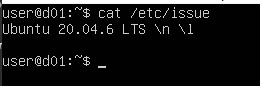
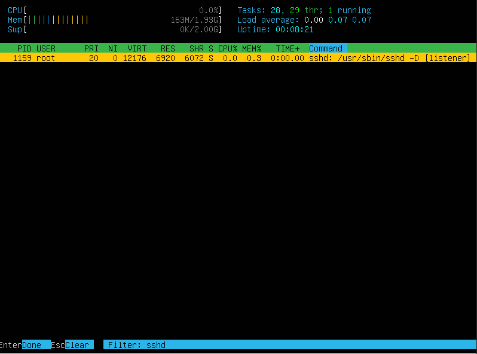
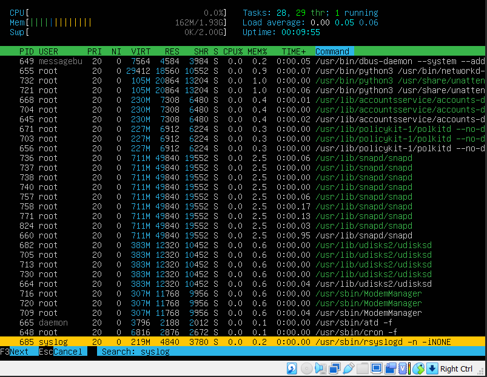
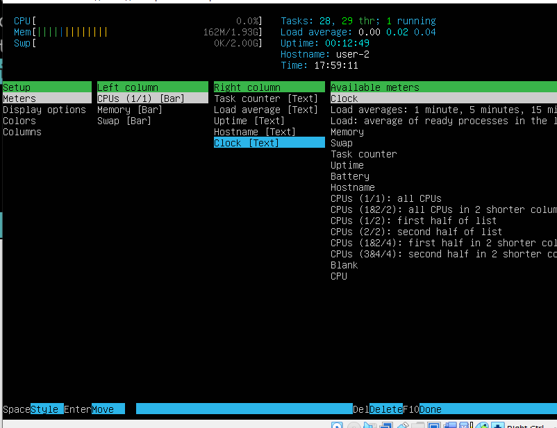
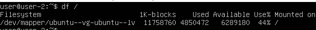

# D01_linux
## Part 1. Установка ОС

Версия установленной ОС
- 
## Part 2. Создание пользователя
Создание пользователя
- 

Пользователь добавлен
- 
## Part 3. Настройка сети ОС
Текущий hostname
- 

Изменение hostname
- 

Hostname изменен
- 

Текущий timezone
- 

Изменение timezone
- 

Timezone изменен
- 

Сетевые интерфейсы
- 

lo - виртуальный сетевой интерфейс loopback. Любой трафик, который посылается компьютерной программой на интерфейс loopback тут же получается тем же интерфейсом.

Вывод ip
- 

DHCP - Dynamical Host Confuration Protocol

Вывод gw
- 

Изменение ip, gw, dns
- 
- 
- 

Проверка изменений
- 

Пингуем хосты
- 
- 
## Part 4. Обновление ОС
Обновление ОС
- 
- 
## Part 5. Использование команды sudo
Разрешение на использование команды sudo
- 

Изменение hostname от нового пользователя
- 
## Part 6. Установка и настройка службы времени
Установка синхронизации времени
- 

Проверка, что все работает
- 
## Part 7. Установка и использование текстовых редакторов
Редактирование в vim (Save and exit :wq)
- 

Редактирование в nano (Save and exit ^O + ^X)
- 

Редактирование в joe (Save and exit ^KX)
- 

Выход без сохранения vim (:q!)
- 

Выход без сохранения nano (^x + y)
- 

Выход без сохранения joe (^C + y)
- 

Поиск и замена в vim (:%s/Что меняем/На что меняем/g)
- 

Результат замены
- 

Поиск и замена в nano (^W, что ищем, ^R, на что меняем)
- 
- 

Поиск и замена в joe (^KF, что ищем, R, на что меняем)
- 
## Part 8. Установка и базовая настройка сервиса SSHD
Установка и добавление в автозапуск службы ssh
- 

Изменение порта
- 
- 

Наличие в выводе команды ps процесса sshd
- 

Использованные опции:
1. -A показать все процессы в том числе служебные
2. -f показать подробную информацию о процессе

Вывод команды netstat -tan
- 

Использованные опции:
1. -t перечислить tcp порты
2. -a перечислить все порты
3. -n команда покажет IP-адрес вместо хоста, номер порта вместо имени порта, UID вместо имени пользователя

Объяснение вывода:
1. Proto - название протокола
2. Recv-Q - количество отправленных пакетов
3. Send-Q - количество полученных пакетов
4. Local Address - локальный IP-адрес участвующий в соединении или связанный со службой, ожидающей входящие соединения (слушающей порт)
5. Foreign Address - внешний IP-адрес, участвующий в создании соединения
6. State - состояние соединения

Значение 0.0.0.0 означает "любой адрес", т.е в соединении могут использоваться все IP-адреса существующие на данном компьютере.
## Part 9. Установка и использование утилит top, htop
Вывод команды top
- 

- Uptime: 4 min
- Количество пользователей: 1
- Общая загрузка системы: 0.10, 0.17, 0.09
- Общее количество процессов: 104
- Загрузка cpu: 0%
- Загрузка памяти: 1971.4
- pid процесса занимающего больше всего памяти: 657
- pid процесса, занимающего больше всего процессорного времени: 1243

Вывод команды htop
- 

Сортировка по PID
- 

Сортировка по загрузке cpu
- 

Сортировка по загрузке памяти
- 

Сортировка по времени процесса
- 

Фильтр для sshd (команда внутри htop fn+f4)
- 

Поиск процесса syslog (команда внутри htop fn+f3)
- 

Добавление нового вывода в htop (fn+f2)
- 

Добавленный вывод hostname, clock и uptime
- 
## Part 10. Использование утилиты fdisk
Вывод утилиты fdisk
- 

Вывод размера файла подкачки
- 

Название жесткого диска: /dev/sda

Размер жесткого диска: 26843545600 байт

Количество секторов: 52428800

Размер swap: 2GB
## Part 11. Использование утилиты df
Вывод команды df без опций
- 

- Размер раздела: 11758760
- Размер занятого пространства: 4850472
- Размер свободного пространства: 6289180
- Процент использования: 44%
- Утилита df без применения опций выводит информацию о размере раздела в блоках по 512 байт

Вывод команды df с опциями -h, -T
- 

- Размер раздела: 12GB
- Размер занятого пространства: 4.7GB
- Размер свободного пространства: 6.0GB
- Процент использования: 44%
- Тип файловой системы для раздела: ext4.
## Part 12. Использование утилиты du
Вывод команды du -bh /home
- 

Вывод команды du -bh /var
- 

Вывод команды du -bh /var/log/*
- 
## Part 13. Установка и использование утилиты ncdu
Установка утилиты ncdu
- 

Размер папок home, var
- 

Размер папки var/log
- 
## Part 14. Работа с системными журналами
Последняя успешная авторизация. Запись найдена в файле /var/log/auth.log
- 

- Время последней успешной авторизации: 17:46:36
- Имя пользователя: user
- Метод входа в систему: LOGIN

Перезапуск службы sshd, информация о ее перезапуске в логах
- 
## Part 15. Использование планировщика заданий CRON
Работа с CRON (комнада crontab -e)
- 

Установка задачи в CRON
- 

Вывод команды uptime с интервалом в 2 минуты
- 

Вывод списка задач командой crontab -l
- \

Очистка списка задач, вывод списка
- 
